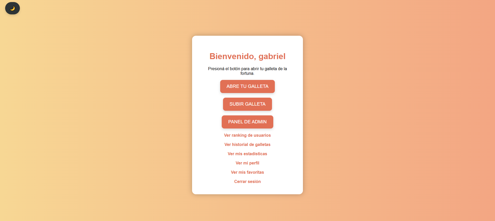
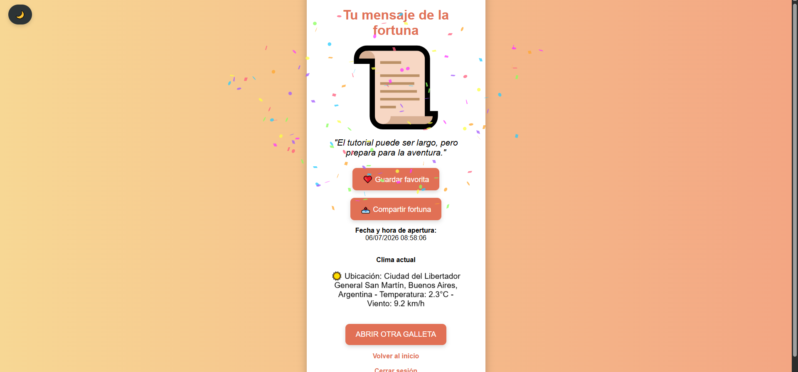
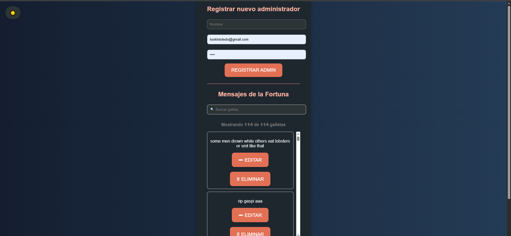
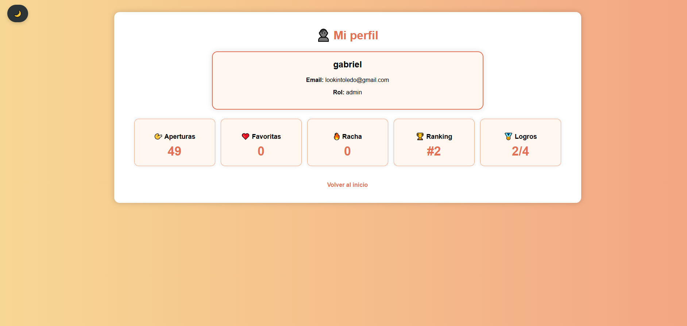
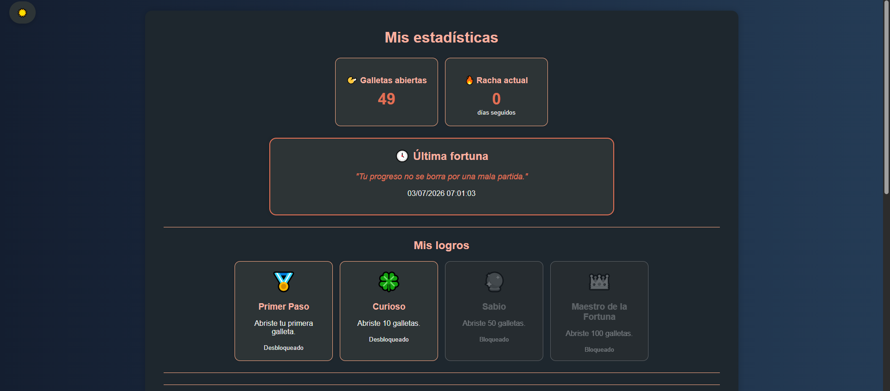
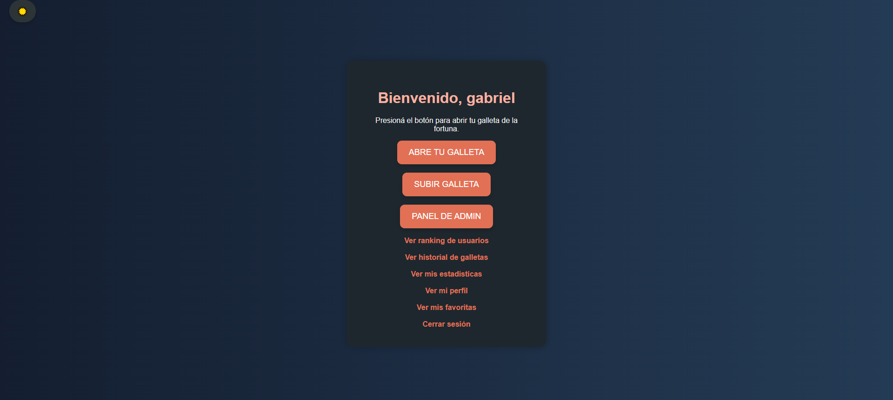
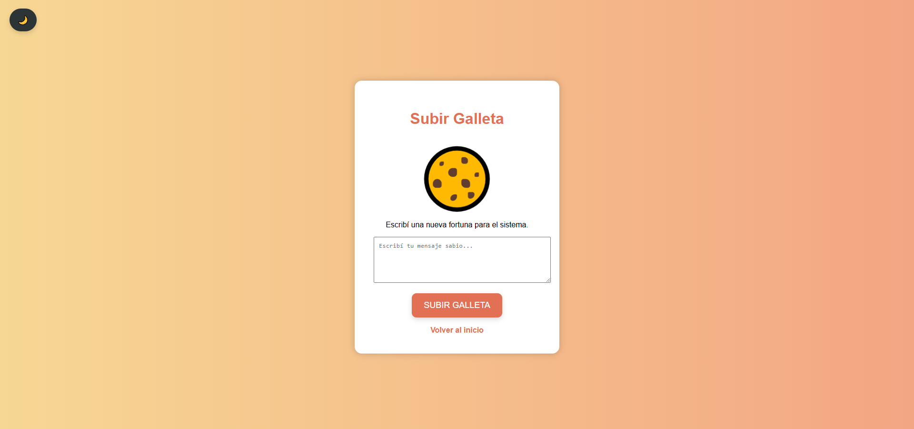
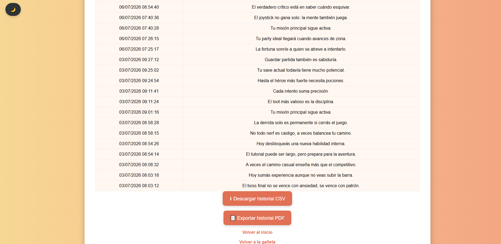

#  Galleta de la Fortuna Pro

## Descripción

Galleta de la Fortuna Pro es una aplicación web desarrollada como evolución del proyecto original de la materia Producción Web. El sistema permite a los usuarios registrarse, iniciar sesión y descubrir mensajes de la fortuna obtenidos aleatoriamente desde una base de datos persistente.

La aplicación incorpora autenticación de usuarios, control de acceso mediante roles, panel de administración, estadísticas, historial de aperturas, favoritos, logros, ranking de usuarios, consumo de APIs externas, animaciones y diversas mejoras de experiencia de usuario.

El proyecto fue desarrollado utilizando Programación Orientada a Objetos (POO) y una arquitectura en capas basada en Controladores, Servicios, Repositorios y Modelos, buscando una solución mantenible, escalable y alineada con las buenas prácticas vistas durante la cursada.

---

#  Instalación

1. Importar el archivo **galleta_fortuna.sql** en phpMyAdmin.
2. Copiar el proyecto dentro de la carpeta **htdocs** de XAMPP.
3. Iniciar Apache y MySQL desde XAMPP.
4. Abrir en el navegador:

```
http://localhost/galleta_fortuna/public
```

---

#  Usuario Administrador

**Email**

```
lookintoledo@gmail.com
```

**Contraseña**

```
1234
```

> La contraseña fue creada antes de implementar las mejoras de seguridad del proyecto.

---

# Funcionalidades principales

## Usuarios

- Registro de usuarios.
- Inicio y cierre de sesión.
- Validaciones backend.
- Gestión de sesiones centralizada.
- Control de acceso por roles.
- Perfil del usuario.
- Modo oscuro.

---

## Galletas de la fortuna

- Apertura de galletas mediante AJAX.
- Animación de apertura.
- Mensajes obtenidos aleatoriamente.
- Historial personal.
- Favoritos.
- Compartir fortuna al portapapeles.
- Exportación del historial en CSV.
- Exportación del historial en PDF.

---

## Estadísticas

- Dashboard personal.
- Dashboard administrativo.
- Ranking de usuarios.
- Top 5 mensajes más utilizados.
- Top 3 usuarios más activos.
- Calendario de actividad tipo GitHub.
- Sistema de logros.
- Racha diaria de aperturas.

---

## Administración

- Panel exclusivo para administradores.
- CRUD completo de mensajes.
- Alta de nuevos administradores.
- Historial global por usuario.
- Buscador inteligente de mensajes.
- Dashboard de estadísticas.
- Panel de salud del sistema.

---

## APIs y Servicios

- API Open-Meteo.
- Servicio de geolocalización mediante Nominatim.
- Consulta automática del clima.
- Sistema de logs de auditoría.

---

## Experiencia de usuario

- Animaciones CSS.
- Confetti al abrir galletas.
- Toast Notifications.
- Responsive Design.
- Modo oscuro persistente.
- Interfaz moderna.

---

#  Seguridad implementada

- Arquitectura en capas.
- Front Controller.
- SessionManager centralizado.
- PDO con consultas preparadas.
- Protección contra SQL Injection.
- Sanitización de salida mediante `htmlspecialchars()`.
- Validaciones backend.
- Control de acceso por roles.
- Manejo de excepciones.
- Credenciales desacopladas mediante configuración.
- Eliminación del uso del operador `@`.
- Registro de auditoría de eventos.

---

# 🛠 Tecnologías utilizadas

- PHP 8
- Programación Orientada a Objetos (POO)
- Arquitectura en Capas
- Front Controller
- MySQL
- PDO
- phpMyAdmin
- HTML5
- CSS3
- JavaScript
- AJAX (Fetch API)
- Chart.js
- Open-Meteo API
- Nominatim API
- Apache Server
- XAMPP
- Git
- GitHub

---

# 📁 Arquitectura

```
app/
│
├── controllers/
├── core/
├── models/
├── repositories/
├── services/
├── validators/
│
config/
│
public/
│
logs/
```

---

#  Versión

## V3.0.0

### Nuevas funcionalidades

- Sistema de perfiles.
- Sistema de favoritos.
- Compartir fortuna.
- Dashboard de estadísticas.
- Dashboard personal.
- Calendario de actividad.
- Sistema de logros.
- Racha diaria.
- Ranking de usuarios.
- Exportación CSV.
- Exportación PDF.
- Buscador inteligente.
- Toast Notifications.
- Confetti.
- Responsive Design.
- Panel de salud del sistema.
- Modo oscuro.
- Mejoras generales de UI/UX.

---

## V2.1.0

- Animaciones.
- Mejoras de CSS.
- Integración de clima.
- Historial.
- CRUD administrativo.

> **IMPORTANTE:** Si las animaciones o los estilos no se visualizan correctamente, presionar **Ctrl + F5** para limpiar la caché del navegador.

---

## Autor

**Gabriel Toledo**

Proyecto desarrollado como trabajo final para la materia **Producción Web**, aplicando los conceptos de arquitectura cliente-servidor, Programación Orientada a Objetos, consumo de APIs, persistencia de datos, seguridad, control de acceso y experiencia de usuario.


# Capturas de pantalla

## Inicio



## Abrir galleta



## Panel Administrador



## Dashboard


## Mi Perfil



## Estadísticas



## Modo oscuro




## subir galleta



## exportar





"No gods or kings, only man"